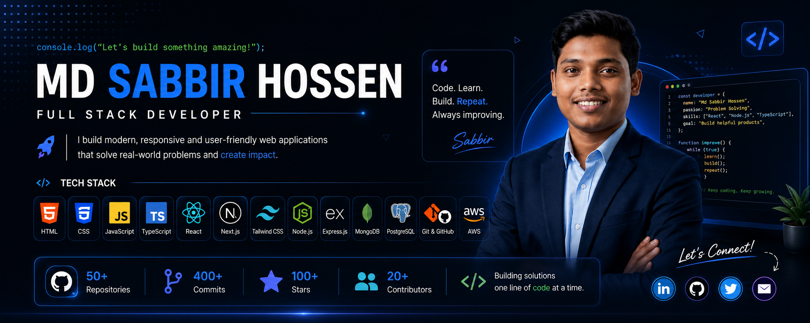

<div align="center">

<!-- Header Banner -->


<br/>

<!-- Animated Typing SVG -->
[](https://git.io/typing-svg)

<!-- Profile Badges -->
<p>
  
  <a href="https://github.com/choyon-dev?tab=followers"></a>
  <a href="https://Sabbirromanbai"></a>
</p>

</div>

---

## About Me

<p>
  <b>Web Designer & Developer</b> with <b>1+ years</b> of industry experience, actively leveling up into <b>MERN Full-Stack Engineering</b>. Hands-on with <b>React, Node.js, Express, MongoDB, and TypeScript</b>—bridging pixel-perfect UI/UX design with robust REST APIs, secure authentication, and scalable database architecture.
</p>

| Location | Experience | Current Focus | Availability |
| :---: | :---: | :---: | :---: |
| **Chittagong, Bangladesh** | **1+ Years Industry** | **MERN Stack & Next.js** | **Freelance & Contract** |

---

## Tech Stack & Tooling

### Platforms & CMS
<p>
  
  
  
  
  
</p>

### Frontend Engineering & UI Libraries
<p>
  
  
  
  
  
  
  
  
  
  
  
  
</p>

### Backend & Databases
<p>
  
  
  
  
  
  
</p>

### Workflow, Testing & Automation
<p>
  
  
  
  
  
  
</p>

---

## Full-Stack Engineering Roadmap & Progression

| Domain / Milestone | Core Technologies & Focus Areas | Progression | Status |
|:---|:---|:---:|:---:|
| **Web Fundamentals & UI** | Semantic HTML5, Modern CSS3, Responsive Design, Tailwind CSS, DaisyUI | `██████████ 100%` |  |
| **JavaScript & DOM Architecture** | ES6+ Syntax, Scopes, Closures, Array Methods, Async/Await, Fetch API | `██████████ 100%` |  |
| **React & SPA Ecosystem** | Component Trees, Core Hooks, React Router DOM v6, React Hook Form | `████████░░ 80%` |  |
| **Backend & RESTful Services** | Node.js Runtime, Express.js Framework, Routing, Custom Middleware, CORS | `██████░░░░ 65%` |  |
| **Database & ODM Modeling** | MongoDB Atlas, Mongoose ODM, Schema Architecture, Aggregation Queries | `██████░░░░ 60%` |  |
| **Authentication & Security** | Firebase Auth Integration, JWT Token Lifecycles, Role-Based Access (RBAC) | `█████░░░░░ 50%` |  |
| **Full-Stack & Payment Gateways** | End-to-End MERN Applications, Stripe & SSLCommerz Integration | `████░░░░░░ 40%` |  |
| **Next-Gen Production Arch** | Next.js (App Router, Server Components, SSR/SSG), TypeScript, Docker | `███░░░░░░░ 30%` |  |

<details>
<summary><b>View Detailed Learning Progression & Topics</b></summary>

<br/>

**Phase 1: Web Fundamentals & UI Architecture (Completed)**
- [x] Semantic HTML5, Page Structure & Web Accessibility (a11y)
- [x] Modern CSS3, Flexbox, CSS Grid & Responsive Layouts
- [x] Utility-First Styling with Tailwind CSS & DaisyUI
- [x] Git & GitHub (Branching, Pull Requests, Version Control)
- [x] Platform & CMS Architecture (WordPress, Webflow, Framer, Shopify)

**Phase 2: Core JavaScript & Asynchronous Programming (Completed)**
- [x] JavaScript Fundamentals (ES6+, Scopes, Closures, Hoisting)
- [x] Array Methods & Data Operations (`map`, `filter`, `reduce`, `find`)
- [x] DOM Traversal, Event Delegation & Dynamic UI Generation
- [x] Asynchronous JavaScript (Promises, `async/await`, Fetch API, Axios)
- [x] Client Storage (`localStorage`, `sessionStorage`, Cookies)

**Phase 3: React.js & Single Page Applications (Active Focus)**
- [x] React Component Architecture, JSX & Props Flow
- [x] Core Hooks (`useState`, `useEffect`, `useRef`, `useMemo`, `useCallback`)
- [x] Single Page Routing with React Router DOM (Dynamic & Nested Routes)
- [x] Form Handling & Validation with React Hook Form
- [ ] Global State Management (Context API & TanStack Query)

**Phase 4: Backend, Database & Authentication (Active Focus)**
- [x] Node.js Runtime Architecture & NPM Package Ecosystem
- [ ] Express.js Server Setup, RESTful Routing & Middleware Design
- [ ] MongoDB Atlas Configuration & Mongoose Schema Modeling
- [ ] Authentication Systems (Firebase Auth, JWT Token Management)
- [ ] Full-Stack CRUD API Design & Error Handling Middleware

**Phase 5: Full-Stack Integration & Production Architecture (Upcoming)**
- [ ] End-to-End MERN Application with Secure Role-Based Access Control
- [ ] Payment Gateway Integration (Stripe & SSLCommerz)
- [ ] Next.js (App Router, Server Components, SSR, SSG & Server Actions)
- [ ] TypeScript Integration for Full-Stack Type Safety
- [ ] Production Deployment & CI/CD Pipelines (Vercel, Render, Railway, Atlas)

## GitHub Analytics

<div align="center">

<a href="https://github.com/Sabbirromanbai">
  
</a>
<a href="https://github.com/Sabbirromanbai">
  
</a>

<br/>

<a href="https://github.com/Sabbirromanbai">
  
</a>

</div>

---

## Contribution Graph

<div align="center">

<picture>
  <source media="(prefers-color-scheme: dark)" srcset="https://raw.githubusercontent.com/choyon-dev/choyon-dev/output/github-contribution-grid-snake-dark.svg" />
  <source media="(prefers-color-scheme: light)" srcset="https://raw.githubusercontent.com/choyon-dev/choyon-dev/output/github-contribution-grid-snake.svg" />
  
</picture>

</div>

---

## Repository Name And Link
--------------------------------------

<div align="center">

# 🚀 Advanced JavaScript

<div align="center">

### ⚡ Exploring the Power of Modern JavaScript

A practice project focused on improving my JavaScript skills through interactive features, DOM manipulation, events, and modern ES6+ concepts.

[🌐 Live Demo](https://github.com/Sabbirromanbai/advance-javascript) • [📂 Source Code](https://github.com/Sabbirromanbai/advance-javascript)

</div>

---
---

## 🛠️ Tech Stack

<p>
  
  
  
</p>

---

## ✨ Key Features

* ⚡ Modern JavaScript (ES6+)
* 🎯 DOM Manipulation
* 🖱️ Event Handling
* 🔄 Dynamic UI Updates
* 🧠 JavaScript Logic & Problem Solving
* 📱 Responsive Interface
* 🧹 Clean & Organized Code

---

## 📦 Dependencies

No external dependencies are required.

This project runs directly in the browser.

---

## 💻 Run Locally

```bash
git clone YOUR_GITHUB_LINK
cd YOUR_PROJECT_FOLDER
```

Then open `index.html` in your browser.

---

## 🎯 Learning Goals

This project was created to strengthen my understanding of **JavaScript fundamentals and advanced concepts** while improving my real-world problem-solving ability.

---

## 🔗 Relevant Links

* 🌐 Live Project: https://github.com/Sabbirromanbai/advance-javascript
* 📂 GitHub Repository: https://github.com/Sabbirromanbai/advance-javascript

---

<div align="center">

⭐ **If you find this project useful, don't forget to Star the repository!**

### Made with ❤️ & JavaScript

</div>

---------------------------------------

# 🏦 Pioneer Bank

<div align="center">

### 💰 A Simple & Interactive Banking Application

A beginner-friendly banking application built with **HTML, CSS, and JavaScript** to practice DOM manipulation, event handling, calculations, and dynamic UI updates.

[🌐 Live Demo](https://sabbirromanbai.github.io/pioneer-bank/) • [📂 Source Code](https://github.com/Sabbirromanbai/pioneer-bank)

</div>

## 🛠️ Tech Stack

<p>
  
  
  
</p>

---

## ✨ Key Features

* 🔐 Simple Login Interface
* 💵 Deposit Money
* 💸 Withdraw Money
* 💰 Dynamic Balance Calculation
* ⚡ Real-time UI Updates
* 🎯 User Interaction
* 📱 Responsive Design

---

## 📦 Dependencies

No external libraries or dependencies are required.

---

## 💻 Run Locally

```bash
git clone YOUR_GITHUB_LINK
cd YOUR_PROJECT_FOLDER
```

Open `index.html` in your browser.

---

## 🧠 Concepts Practiced

* JavaScript Functions
* DOM Manipulation
* Event Listeners
* Conditional Logic
* Mathematical Operations
* Input Handling
* Dynamic Content

---

## 🔗 Relevant Links

* 🌐 Live Project: https://sabbirromanbai.github.io/pioneer-bank/
* 📂 GitHub Repository: https://github.com/Sabbirromanbai/pioneer-bank

---

<div align="center">

⭐ **Star this repository if you like the project!**

### Built with 💙 using HTML, CSS & JavaScript

</div>

-------------------------------------------------------

# 🔐 Pin Matcher

<div align="center">

### 🔢 Generate • Enter • Match • Verify

A simple interactive **PIN Matcher application** built with HTML, CSS, and JavaScript. This project focuses on user input, random PIN generation, validation, and dynamic UI interaction.

[🌐 Live Demo](https://sabbirromanbai.github.io/pin-matcher/) • [📂 Source Code](https://github.com/Sabbirromanbai/pin-matcher)

</div>

--------------------

## 🛠️ Tech Stack

<p>
  
  
  
</p>

---

## ✨ Key Features

* 🔢 Random PIN Generation
* ⌨️ User PIN Input
* 🔍 PIN Matching
* ✅ Success Feedback
* ❌ Error Feedback
* 🔄 Try Again Functionality
* ⚡ Dynamic Interface
* 📱 Responsive Design

---

## 📦 Dependencies

No external dependencies are required.

The project runs directly in the browser.

---

## 💻 Run Locally

```bash
git clone YOUR_GITHUB_LINK
cd YOUR_PROJECT_FOLDER
```

Open `index.html` in your browser.

---

## 🧠 Concepts Practiced

* JavaScript Functions
* Random Number Generation
* DOM Manipulation
* Event Handling
* Conditional Statements
* Input Validation
* String & Number Handling

---

## 🔗 Relevant Links

* 🌐 Live Project: https://sabbirromanbai.github.io/pin-matcher/
* 📂 GitHub Repository: https://sabbirromanbai.github.io/pin-matcher/

---

<div align="center">

⭐ **If you like this project, consider giving it a Star!**

### Made with ❤️ & JavaScript

</div>


---------------------------------------------------------

## Connect & Collaborate

<div align="center">

<!-- ===================== SOCIAL BADGES ===================== -->

<a href="https://github.com/Sabbirromanbai">

</a>

<a href="https://www.linkedin.com/in/md-sabbir-roman-9000593b6/">

</a>

<a href="https://www.facebook.com/SABBIRROMAN32">

</a>

<a href="https://protfolio-sabbir-mapf6e2gu-sabbirromanbais-projects.vercel.app/">

</a>

<br/><br/>


<br/>

**Available for freelance projects, technical consulting, and development contracts.**  
*Kornofuli, Chittagong, Bangladesh • GMT+6*

</div>


